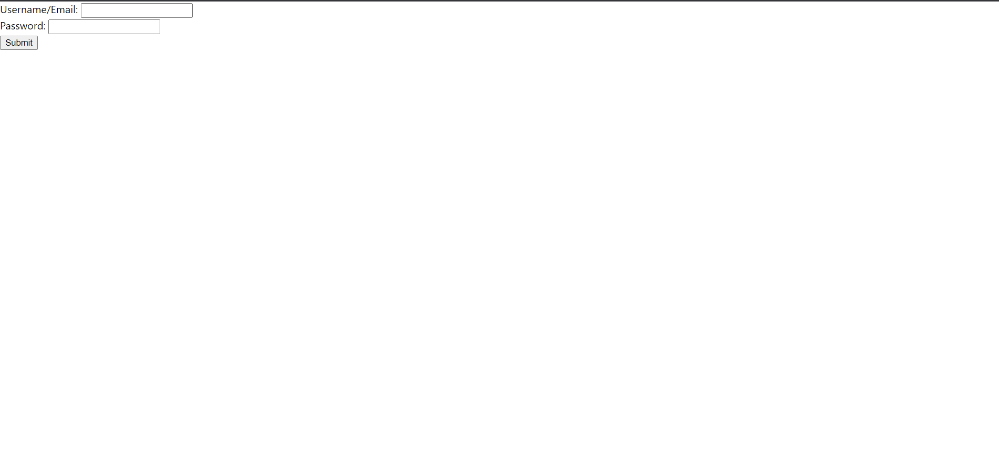
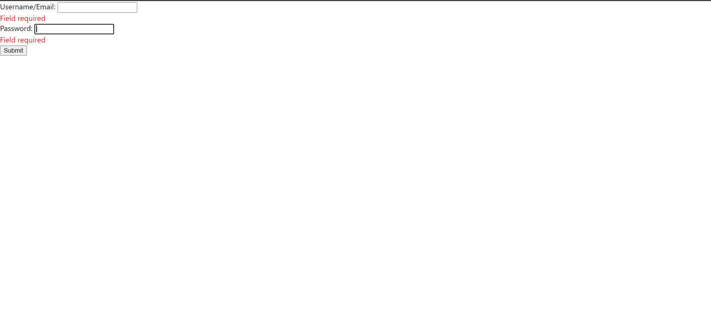
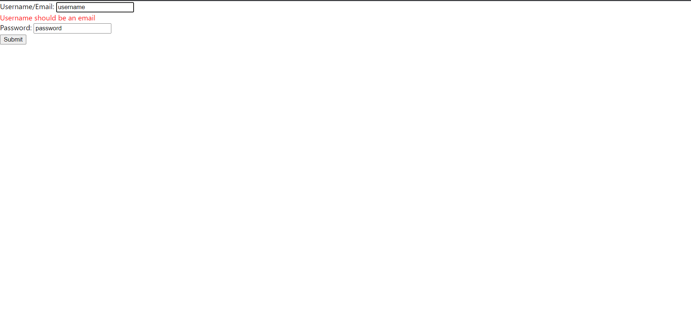
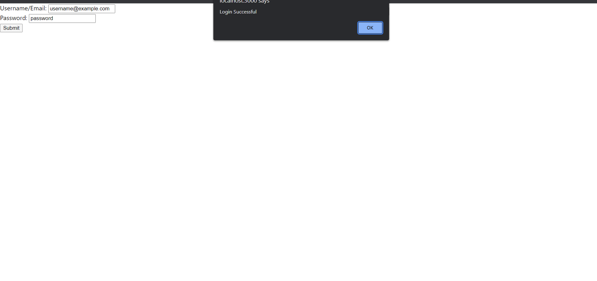

# Build_A_Formik

  
## Description:
  This is assignment from ***Professional Certificate in Coding: Full Stack Development with MERN*** Week13.
  This program consists of javascript, html, and img files.
  This program check validation of login ID. If the E-mail(username) or pawword is invalid, then show the error messages in red.
  If the E-mail and password are valid, then browser shows "Login Successful" in an alert box.

## Installation:
  1. Downloads each file into one file.  
    1. **public/index.html**  
    2. **src/index.js**  
    3. **src/App.js**  
    4. **src/index.css**  
  2. Put **index.js**, **App.js**, **index.css** files in **src** directory.
  3. Open shell and type **npm install formik --save**.
  4. Type **npm install** and **npm start**.
  5. Drag and drop **index.html** on the browser.
  
## Usage:
  
If successfully installed and run on the Web browser, the textboxes show the left corner of the browser.

  
## Support:
  If any question, message me via **[my twitter](https://twitter.com/Kojiro38895598)**.
  
## Roadmap:
  The update is not expected.
  
## License information: 
 The most of the program is coded and contrubuted by MIT. If you use the part of this code in your program and show it to public, please include the name of ***MIT***.
